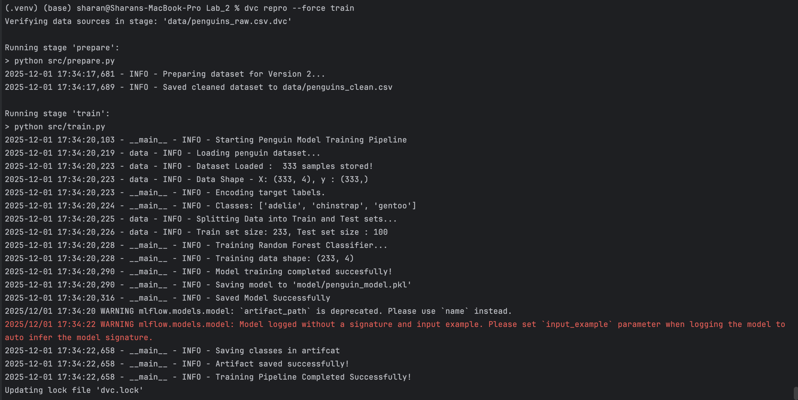

---
- Video Explanation: [FastAPI lab](https://www.youtube.com/watch?v=KReburHqRIQ&list=PLcS4TrUUc53LeKBIyXAaERFKBJ3dvc9GZ&index=4)
- Blog: [FastAPI Lab-1](https://www.mlwithramin.com/blog/fastapi-lab1)

---

# Penguin Classifier with FastAPI, MLflow, and DVC

End-to-End MLOps Workflow: Data → Training → Model Versioning → API Inference Logging

This project demonstrates a complete MLOps workflow using:
    1. DVC for dataset and model versioning
    2. MLflow for experiment, training, and inference tracking
    3. FastAPI for serving real-time predictions
    4. Scikit-learn for model training

The model predicts penguin species (Adelie, Gentoo, Chinstrap) using bill length, bill depth, flipper length, and body mass.

---------------------------------------------------------------------

## Project Structure

-project_folder/
    |
    |-- src/
        |--main.py   FastAPI application
        |--train.py Training pipeline
        |--predict.py Model inference logic
        |--data.py Data loading and splitting
        |--mlflow_config.py MLflow configuration (New Addition from previous log lab submission)
    |-- model/ Model and artifacts
    |-- data/
    |   |-- penguins_raw.csv          # DVC-tracked raw dataset
    |   |-- penguins_clean.csv        # DVC-generated clean dataset
    |--logs/ Log files
    |--mlruns/ MLflow tracking storage
    |-- dvc.yaml
    |-- dvc.lock
    |-- README.md

---------------------------------------------------------------------

## Part 1: Loading and Preparing the Data

The dataset used is the Palmer Penguins dataset provided through the seaborn library.
The preprocessing steps:
1. Load dataset
2. Keep numeric features
3. Normalize column names
4. Convert species labels to lowercase
5. Drop missing values
6. Save cleaned dataset as data/penguins_clean.csv

DVC tracks this stage:

dvc stage add -n prepare \
    -d src/prepare.py \
    -d data/penguins_raw.csv \
    -o data/penguins_clean.csv \
    python src/prepare.py

---------------------------------------------------------------------

## Part 2: Model Training with MLflow (DVC Stage: Train)

The train.py script performs the following actions:

1. Load cleaned data
2. Encode labels using LabelEncoder
3. Train a RandomForestClassifier
4. Save model to model/penguin_model.pkl
5. Save class name artifact to model/penguin_artifact.joblib
6. Log training parameters to MLflow
7. Log the trained model to MLflow

DVC training stage:

dvc stage add -n train \
    -d src/train.py \
    -d data/penguins_clean.csv \
    -o model/penguin_model.pkl \
    python src/train.py

To run the full DVC pipline, run : dvc repro

---------------------------------------------------------------------

## Part 3: Model Inference with Prediction Logging

The predict.py script:

1. Loads the trained model from the model folder  
2. Accepts a numpy array of penguin features  
3. Makes a prediction  
4. Logs input shape, number of predictions, and inference metadata to MLflow using a nested run  

This nested logging allows inference logs to be visually grouped under parent API calls during FastAPI execution.

MLflow Inference Run Screenshot Placeholder:  
Insert MLflow Inference Run Screenshot Here.

---------------------------------------------------------------------

## Part 4: FastAPI Prediction Endpoint with MLflow Logging

The main.py file runs the FastAPI server and exposes a prediction endpoint.

When a POST request is sent to /predict:

1. MLflow starts a run to track the entire API request  
2. The penguin features received from the client are logged  
3. The prediction function is called, which creates a nested inference run  
4. MLflow logs prediction outputs and latency  
5. The API responds with the predicted penguin species  

This provides full observability for every prediction request made to the API.

MLflow API Request Run Screenshot Placeholder:  
Insert MLflow API Request Screenshot Here.

---------------------------------------------------------------------

## How to Run This Project

Step 1: Navigate to your project folder  
Step 2: Install dependencies  " pip install fastapi uvicorn scikit-learn seaborn mlflow joblib numpy"
Step 3 : Reproduce the full DVC pipeline (Prepare + Train) using dvc repro
Step 4: Start the FastAPI server from Lab_2, uvicorn src.main:app --reload
Step 5: Test the API using the built-in Swagger UI : Open in your browser:  http://127.0.0.1:8000/docs
Step 6: Start MLflow UI (run in a new terminal window)  : navigate to code folder :  execute mlflow ui --backend-store-uri ../mlruns
        Open MLflow dashboard:  http://127.0.0.1:5000

---------------------------------------------------------------------

## MLflow Runs Expected

The following MLflow runs should appear in the UI:

1. A training_run from train.py  
2. An inference_run nested inside training or API calls  
3. An api_request run for each call to the FastAPI /predict endpoint  

Attach the corresponding screenshots under the placeholders provided above.

---------------------------------------------------------------------

## Summary

This lab demonstrates:

1. How to train a machine learning model and save artifacts  
2. How to build a prediction API using FastAPI  
3. How to integrate MLflow for experiment tracking  
4. How to track training, inference, and live API usage  
5. How to view experiment data using the MLflow UI  
6. How to control data versions and reproduce them with projects

This provides a complete end-to-end workflow for machine learning operations, from data loading to production-like logging of inference events.
