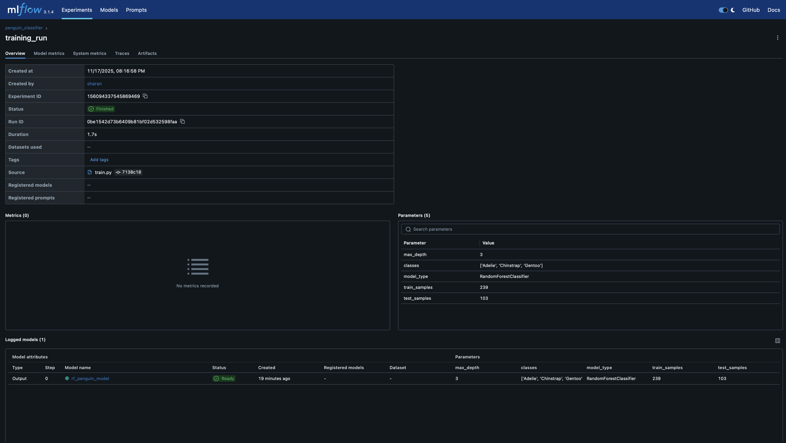
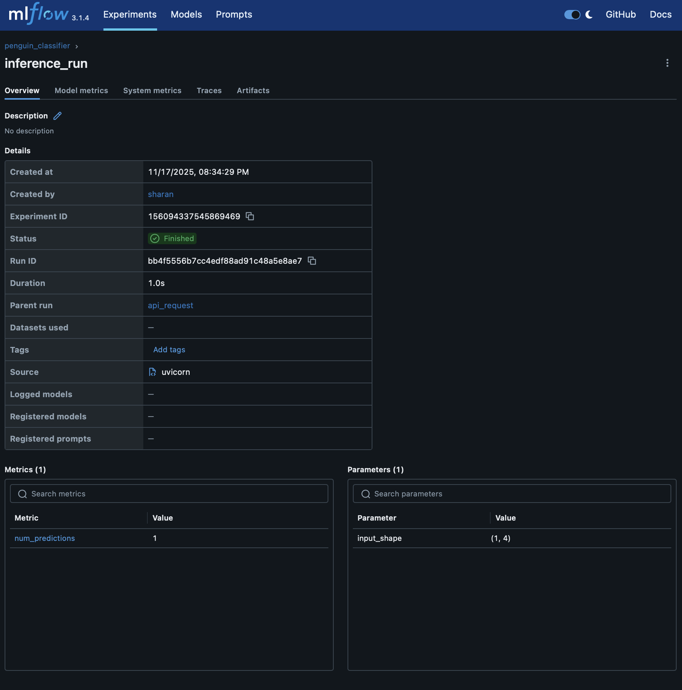
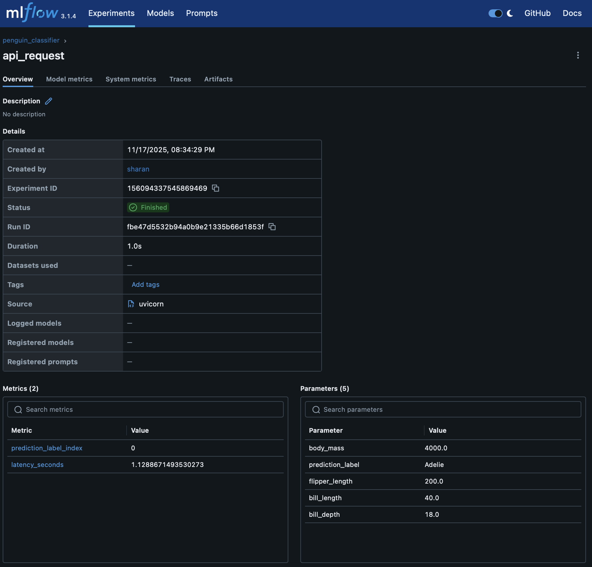

---
- Video Explanation: [FastAPI lab](https://www.youtube.com/watch?v=KReburHqRIQ&list=PLcS4TrUUc53LeKBIyXAaERFKBJ3dvc9GZ&index=4)
- Blog: [FastAPI Lab-1](https://www.mlwithramin.com/blog/fastapi-lab1)

---

# Penguin Classifier with FastAPI and MLflow

This project demonstrates how to build, train, and deploy a machine learning model using FastAPI and track all training and inference activity with MLflow. The machine learning model predicts the species of a penguin based on bill length, bill depth, flipper length, and body mass.

The lab consists of four major components:
1. Data loading and preprocessing
2. Model training and artifact generation
3. FastAPI prediction service
4. MLflow experiment tracking across training and inference

Screenshot placeholders are included so that MLflow UI outputs can be added to the document.

---------------------------------------------------------------------

## Project Structure

-project_folder/
    |
    |-- src/
        |--main.py   FastAPI application
        |--train.py Training pipeline
        |--predict.py Model inference logic
        |--data.py Data loading and splitting
        |--mlflow_config.py MLflow configuration (New Addition from previous log lab submission)
    |-- model/ Model and artifacts
    |--logs/ Log files
    |--mlruns/ MLflow tracking storage

---------------------------------------------------------------------

## Part 1: Loading and Preparing the Data

The dataset used is the Palmer Penguins dataset provided through the seaborn library.  
The data.py file loads the dataset, selects numeric features, removes missing values, and splits the dataset into training and testing sets.

---------------------------------------------------------------------

## Part 2: Training the Model with MLflow Tracking

The train.py script performs the following actions:

1. Loads and preprocesses the dataset  
2. Encodes the target labels  
3. Trains a RandomForestClassifier  
4. Saves the trained model to the model folder  
5. Saves a label artifact containing the class names  
6. Logs all training parameters, dataset sizes, model type, and artifacts to MLflow  
7. Logs the trained model as an MLflow model  

MLflow Run Screenshot:  

---------------------------------------------------------------------

## Part 3: Model Inference with Prediction Logging

The predict.py script:

1. Loads the trained model from the model folder  
2. Accepts a numpy array of penguin features  
3. Makes a prediction  
4. Logs input shape, number of predictions, and inference metadata to MLflow using a nested run  

This nested logging allows inference logs to be visually grouped under parent API calls during FastAPI execution.

MLflow Inference Run Screenshot :  

---------------------------------------------------------------------

## Part 4: FastAPI Prediction Endpoint with MLflow Logging

The main.py file runs the FastAPI server and exposes a prediction endpoint.

When a POST request is sent to /predict:

1. MLflow starts a run to track the entire API request  
2. The penguin features received from the client are logged  
3. The prediction function is called, which creates a nested inference run  
4. MLflow logs prediction outputs and latency  
5. The API responds with the predicted penguin species  

This provides full observability for every prediction request made to the API.

MLflow API Request Run Screenshot Placeholder:  

---------------------------------------------------------------------

## How to Run This Project

Step 1: Navigate to your project folder  
Step 2: Install dependencies  " pip install fastapi uvicorn scikit-learn seaborn mlflow joblib numpy"
Step 3: Train the model 
Step 4: Start the FastAPI server
Step 5: Test the API using the built-in Swagger UI : Open in your browser:  http://127.0.0.1:8000/docs
Step 6: Start MLflow UI (run in a new terminal window)  : navigate to code folder :  execute mlflow ui --backend-store-uri ../mlruns
        Open MLflow dashboard:  http://127.0.0.1:5000

---------------------------------------------------------------------

## MLflow Runs Expected

The following MLflow runs should appear in the UI:

1. A training_run from train.py  
2. An inference_run nested inside training or API calls  
3. An api_request run for each call to the FastAPI /predict endpoint  

Attach the corresponding screenshots under the placeholders provided above.

---------------------------------------------------------------------

## Summary

This lab demonstrates:

1. How to train a machine learning model and save artifacts  
2. How to build a prediction API using FastAPI  
3. How to integrate MLflow for experiment tracking  
4. How to track training, inference, and live API usage  
5. How to view experiment data using the MLflow UI  

This provides a complete end-to-end workflow for machine learning operations, from data loading to production-like logging of inference events.
