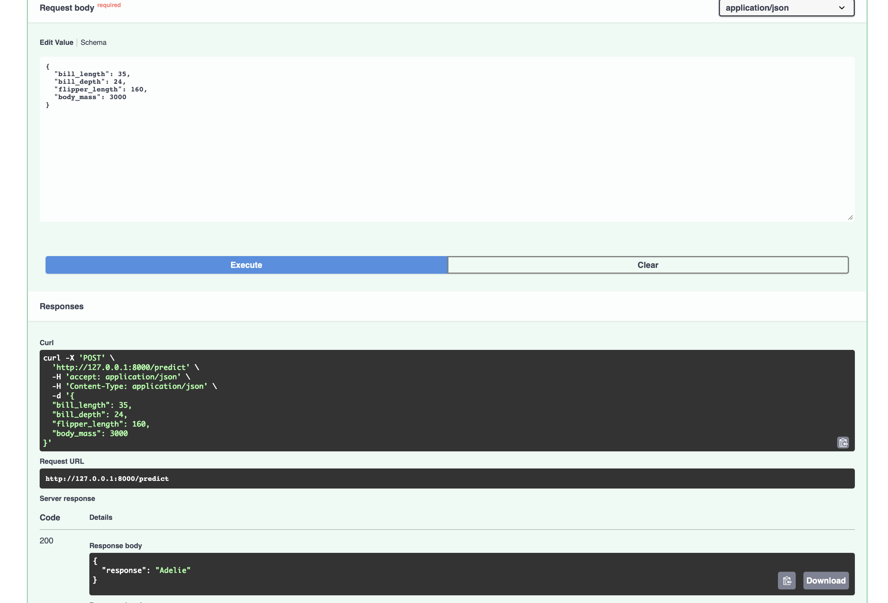

---
- Video Explanation: [FastAPI lab](https://www.youtube.com/watch?v=KReburHqRIQ&list=PLcS4TrUUc53LeKBIyXAaERFKBJ3dvc9GZ&index=4)
- Blog: [FastAPI Lab-1](https://www.mlwithramin.com/blog/fastapi-lab1)

---

## Overview

In this Lab, we will learn how to log and expose ML models as APIs using [FastAPI](https://fastapi.tiangolo.com/) and [uvicorn](https://www.uvicorn.org/).
1. **FastAPI**: FastAPI is a modern, fast (high-performance), web framework for building APIs with Python based on standard Python type hints.
2. **uvicorn**: Uvicorn is an [Asynchronous Server Gateway Interface - ASGI](https://youtu.be/vKjCkeJGbNk) web server implementation for Python. It is often used to serve FastAPI aplications.

The workflow involves the following steps:
1. Training a Random Forest Classifier on Palmer Penguins Dataset.
2. Serving the trained model as an API using FastAPI and uvicorn.
3. Logging all steps from Training and API calls.

## Setting up the lab

1. Create a virtual environment(e.g. **fastapi_lab1_env**).
2. Activate the environment and install the required packages using `pip install -r requirements.txt`.
3. Implementing comprehensive logging for experiment tracking and monitoring.

## New in Lab5

This lab extends the FastAPI implementation with:
- **Docker containerization** for consistent deployment
- **CI/CD pipeline** using GitHub Actions (Docker Build and Test) for automated testing
- **Feature branch workflow** for safe development practices

### Project structure
```
Labs/Github_Labs/Lab5/
├── .github/
│   └── workflows/
│       └── test_new_push.yml    # CI/CD pipeline configuration
├── assets/
│   ├── api_documentation.png
│   ├── api_response.png
│   └── docs.png
├── logs/
│   ├── api.log                     # API request/response logs
│   └── training.log                # Model Training Logs
├── model/
│   ├── penguin_artifact.joblib     # Label encoder classes
│   └── penguin_model.pkl           # Trained model
├── src/
│   ├── __init__.py
│   ├── data.py                     # Data loading and preprocessing
│   ├── main.py                     # FastAPI application
│   ├── predict.py                  # Prediction logic
│   └── train.py                    # Model training pipeline
├── Dockerfile                       # Docker container definition
├── README.md                        # This file
└── requirements.txt                 # Python dependencies
```

Note:
- **fastapi[all]** in **requirements.txt** will install optional additional dependencies for fastapi which contains **uvicorn** too.
- Make sure to create a **logs/** directory in your project root before running the application, or update the logging configuration to create it automatically:
```python
  import os
  os.makedirs('logs', exist_ok=True)
```

## Docker Setup

### Prerequisites
- Docker installed on your machine ([Install Docker](https://docs.docker.com/get-docker/))
- Git for version control

### Quick Start with Docker

1. **Build the Docker image:**
```bash
   docker build -t penguin-api .
```

2. **Run the container:**
```bash
   docker run -p 8000:8000 penguin-api
```

3. **Access the API:**
   - Health check: http://localhost:8000/
   - API docs: http://localhost:8000/docs

The container automatically trains the model and starts the API server!

### Docker Commands Reference
```bash
# Build image
docker build -t penguin-api .

# Run container (foreground)
docker run -p 8000:8000 penguin-api

# Run container (background/detached)
docker run -d -p 8000:8000 --name penguin-container penguin-api

# View container logs
docker logs penguin-container

# Follow logs in real-time
docker logs -f penguin-container

# Stop container
docker stop penguin-container

# Remove container
docker rm penguin-container

# List running containers
docker ps

# List all containers
docker ps -a
```

## Running the Lab - Without Docker 

1. First step is to train a Decision Tree Classifier(Although you have **`model/iris_model.pkl`** when you cloned from the repo, let's create a new model). To do this, move into **src/** folder with
    ```bash
    cd src
    ```
2. To train the Decision Tree Classifier, run:
    ```bash
    python train.py
    ```
3. To serve the trained model as an API, run:
    ```bash
    uvicorn app:main --reload
    ```
4. Testing endpoints - to view the documentation of your api model you can use [http://127.0.0.1:8000/docs](http://127.0.0.1:8000/docs) (or) [http://localhost:8000/docs](http://localhost:8000/docs) after you run you run your FastAPI app.
    

   
You can also test out the results of your endpoints by interacting with them. Click on the dropdown button of your endpoint -> Try it out -> Fill the Request body -> Click on Execute button.



- You can also use other tools like [Postman](https://www.postman.com/) for API testing.

### FastAPI Syntax

- The instance of FASTAPI class can be defined as:
    ```bash
    app = FastAPI()
     ```
- When you run a FastAPI application, you often pass this app instance to an ASGI server uvicorn. The server then uses the app instance to handle incoming web requests and send responses based on the routes and logic you’ve defined in your FastAPI application.
- To run a FastAPI application, run:
    ```
    uvicorn main:app --reload
    ```
- In this command, **main** is the name of the Python file containing your app instance (without the .py extension), and **app** is the name of the instance itself. The **--reload** flag tells uvicorn to restart the server whenever code changes are detected, which is useful during development and should not be used in production.
- All the functions which should be used as API should be prefixed by **@app.get("/followed_by_endpoint_name")** or **@app.post("/followed_by_endpoint_name")**. This particular syntax is used to define route handlers (which function should handle an incoming request based on the URL and HTTP method), which are the functions responsible for responding to client requests to a given endpoint.
    1. **Decorator (@)**: This symbol is used to define a decorator, which is a way to dynamically add functionality to functions or methods. In FastAPI, decorators are used to associate a function with a particular HTTP method and path.
    2. **App Instance (app)**: This represents an instance of the FastAPI class. It is the core of your application and maintains the list of defined routes, request handlers, and other configurations.
    3. **HTTP Method (get, post, etc.)**: The HTTP method specifies the type of HTTP request the route will respond to. For example, get is used for retrieving data, and post is used for sending data to the server. FastAPI provides a decorator for each standard HTTP method, such as @app.put, @app.delete, @app.patch, and @app.options, allowing you to define handlers for different types of client requests. For detailed info refer to this webiste by [Mdn](https://developer.mozilla.org/en-US/docs/Web/HTTP/Methods).
    4. **Path/Endpoint ("/endpoint_name")**: This is the URL path where the API will be accessible. When a client makes a request to this path using the specified HTTP method, FastAPI will execute the associated function and return the response.
- Using **async** in FastAPI allows for non-blocking operations, enabling the server to handle other requests while waiting for I/O tasks, like database queries or model loading, to complete. This leads to improved concurrency and resource utilization, enhancing the application's ability to manage multiple simultaneous requests efficiently.
- 
## Logging Implementation

This lab implements comprehensive logging to track all API interactions, model predictions, and errors for experiment tracking purposes.

### Logging Features

1. **Automatic Request/Response Logging**
   - Every API call is logged via middleware
   - Captures HTTP method, endpoint, timestamp, and response time
   - Records status codes for success/failure tracking

2. **Prediction Logging**
   - Logs input features for each prediction
   - Records predicted species
   - Tracks model loading operations

3. **Error Logging**
   - Captures exceptions with full stack traces
   - Provides context for debugging
   - Records failed requests with error details

4. **Dual Output**
   - **File Logging**: All logs saved to `logs/api.log`
   - **Console Logging**: Real-time output in terminal

### Viewing Logs

After running the API and making requests through Swagger UI, you can view the logs:
```bash
# View the entire log file
cat logs/api.log

# View last 50 lines
tail -50 logs/api.log

# Follow logs in real-time
tail -f logs/api.log
```

### Sample Log Output
```
2025-10-20 15:30:00 - __main__ - INFO - FastAPI Penguin Prediction API Starting Up
2025-10-20 15:30:15 - __main__ - INFO - Incoming request: POST /predict
2025-10-20 15:30:15 - __main__ - INFO - Input features - Bill Length: 39.1, Bill Depth: 18.7, Flipper Length: 181.0, Body Mass: 3750.0
2025-10-20 15:30:15 - __main__ - INFO - Prediction successful: Adelie
2025-10-20 15:30:15 - __main__ - INFO - Request completed: POST /predict - Status: 200 - Time: 0.045s
```

### Logging Configuration

The logging system is configured in `main.py`:
```python
import logging

logging.basicConfig(
    level=logging.INFO,
    format='%(asctime)s - %(name)s - %(levelname)s - %(message)s',
    handlers=[
        logging.FileHandler('logs/api.log'),
        logging.StreamHandler()
    ]
)
```

**Log Levels Used:**
- `INFO`: General operational messages (requests, predictions)
- `DEBUG`: Detailed diagnostic information
- `ERROR`: Error messages with context
- `EXCEPTION`: Full exception details with traceback

### Middleware for Automatic Logging

The application uses FastAPI middleware to automatically log all HTTP requests:
```python
@app.middleware("http")
async def log_requests(request: Request, call_next):
    start_time = time.time()
    logger.info(f"Incoming request: {request.method} {request.url.path}")
    
    response = await call_next(request)
    process_time = time.time() - start_time
    
    logger.info(
        f"Request completed: {request.method} {request.url.path} - "
        f"Status: {response.status_code} - Time: {process_time:.3f}s"
    )
    return response
```

**What is Middleware?**

Middleware is a function that intercepts every HTTP request before it reaches your endpoint and every response before it's sent back to the client. Think of it as a checkpoint that all traffic must pass through.

**Request Flow with Middleware:**
```
User Request → [Middleware Logs] → Endpoint Function → [Middleware Logs] → Response to User
```

This ensures complete tracking of all API activity without manually adding logging code to each endpoint.


## Dataset Used
The pipeline uses the **Palmer Penguins dataset** (via Seaborn) and predicts a penguin’s **species** (`Adelie`, `Chinstrap`, or `Gentoo`) based on four numeric features.

###  Features
| Feature | Description |
|----------|-------------|
| `bill_length_mm` | Length of the penguin’s bill (mm) |
| `bill_depth_mm` | Depth of the penguin’s bill (mm) |
| `flipper_length_mm` | Length of the penguin’s flipper (mm) |
| `body_mass_g` | Body mass of the penguin (g) |


### Data Models in FastAPI

##### 1. PenguinData class


```python
class PenguinData(BaseModel):
    bill_length: float
    bill_depth: float
    flipper_length: float
    body_mass: float
```

The **PenguinData** class is a [Pydantic model](https://docs.pydantic.dev/latest/concepts/models/) which defines the expected structure of the data for a request body. When you use it as a type annotation for a route operation parameter, FastAPI will perform the following actions:
- **Request Body Reading:** FastAPI will read the request body as JSON.
- **Data Conversion:** It will convert the corresponding types, if necessary.
- **Data Validation:** It will validate the data. If the data is invalid, it will return a 422 Unprocessable Entity error response with details about what was incorrect.

#### 2. PenguinResponse class

```python
class PenguinResponse(BaseModel):
    response:str
```
The **IrisResponse** class is another Pydantic model that defines the structure of the response data for an endpoint. When you specify **response_model=IrisResponse** in a route operation, it tells FastAPI to:
- **Serialize the Output**: Convert the output data to JSON format according to the IrisResponse model.
- **Document the API**: Include the IrisResponse model in the generated API documentation, so API consumers know what to expect in the response.

---

### FastAPI features

1. **Request Body Reading**: When a client sends a request to a FastAPI endpoint, the request can include a body with data. For routes that expect data (commonly POST, PUT, or PATCH requests), this data is often in JSON format. FastAPI automatically reads the request body by checking the Content-Type header, which should be set to application/json for JSON payloads.
2. **Data Conversion**: Once the request body is read, FastAPI utilizes Pydantic models to parse the JSON data. Pydantic attempts to construct an instance of the specified model using the data from the request body. During this instantiation, Pydantic converts the JSON data into the proper Python data types as declared in the model.
    - For instance, if the JSON object has a field like petal_length with a value of "5.1" (a string), and the model expects a float, Pydantic will transform the string into a float. If conversion isn't possible (say, the value was "five point one"), Pydantic will raise a validation error.
3. **Data Validation**: Pydantic checks that all required fields are present and that the values are of the correct type, adhering to any constraints defined in the model (such as string length or number range). If the validation passes, the endpoint has a verified Python object to work with. If validation fails (due to missing fields, incorrect types, or constraint violations), FastAPI responds with a 422 Unprocessable Entity status. This response includes a JSON body detailing the validation errors, aiding clients in correcting their request data.
4. **Error Handling**: Error handling in FastAPI can be effectively managed using the HTTPException class. HTTPException is used to explicitly signal an HTTP error status code and return additional details about the error. When an HTTPException is raised within a route, FastAPI will catch the exception and use its content to form the HTTP response.
- **Instantiation**: The HTTPException class is instantiated with at least two arguments: status_code and detail. The status_code argument is an integer that represents the HTTP status code (e.g., 404 for Not Found, 400 for Bad Request). The detail argument is a string or any JSON-encodable object that describes the error.
- **Response**: When an HTTPException is raised, FastAPI sends an HTTP response with the status code specified. The detail provided in the HTTPException is sent as the body of the response in JSON format.

```python
from fastapi import FastAPI, HTTPException

app = FastAPI()

@app.get("/items/{item_id}")
async def read_item(item_id: int):
    item = get_item_by_id(item_id)  # Hypothetical function to fetch an item
    if item is None:
        raise HTTPException(status_code=404, detail=f"Item with ID {item_id} not found")
    return item
```

In this example, **get_item_by_id** is a function that retrieves an item based on its ID. If no item with the given ID is found, an HTTPException with a 404 Not Found status code is raised, and the detail message is customized to include the ID of the item that was not found.

FastAPI will catch this exception and return a response with a 404 status code and a JSON body like this:

```json
{
    "detail": "Item with ID 1 not found"
}
```

## Docker Setup

### Prerequisites
- Docker installed on your machine ([Install Docker](https://docs.docker.com/get-docker/))
- Git for version control

### Quick Start with Docker

1. **Build the Docker image:**
```bash
   docker build -t penguin-api .
```

2. **Run the container:**
```bash
   docker run -p 8000:8000 penguin-api
```

3. **Access the API:**
   - Health check: http://localhost:8000/
   - API docs: http://localhost:8000/docs

The container automatically trains the model and starts the API server!


## CI/CD Pipeline

This project includes automated testing via GitHub Actions.

### What is CI/CD?

**CI (Continuous Integration):** Automatically tests your code every time you push changes to ensure nothing breaks.

**What happens when you push to `featurea` branch:**
1. GitHub Actions triggers automatically
2. Builds Docker image
3. Starts container
4. Tests health endpoint (`/`)
5. Tests prediction endpoint (`/predict`)
6. Reports success or failure

### Viewing Test Results

1. Go to your repository on GitHub
2. Click the **Actions** tab
3. Select the latest workflow run
4. View detailed logs for each step

### Workflow Configuration

The CI/CD pipeline is defined in `.github/workflows/lab5-docker-test.yml`

**Triggers:**
- Pushes to `featurea` branch
- Only when files in `Labs/Github_Labs/Lab5/` change

**Benefits:**
- Catches bugs before merging to main
- Ensures code works in clean environment
- Automated testing saves time
- Protects production code quality

### Feature Branch Workflow
```bash
# 1. Create feature branch
git checkout -b featurea

# 2. Make changes and commit
git add .
git commit -m "Add new feature"

# 3. Push to trigger automated tests
git push origin featurea

# 4. Check GitHub Actions for test results

# 5. Merge to main after tests pass
git checkout main
git merge featurea
git push origin main
```
## Troubleshooting

### Docker Issues

**Problem:** `Cannot find Dockerfile`
```bash
# Solution: Ensure Dockerfile is in the Lab5 root directory
ls Dockerfile  # Should show the file
```

**Problem:** `Port 8000 already in use`
```bash
# Solution: Stop the process using port 8000
lsof -i :8000          # Find the process
kill -9           # Kill it
# OR use a different port
docker run -p 8001:8000 penguin-api
```

**Problem:** Container exits immediately
```bash
# Solution: Check container logs for errors
docker logs penguin-container
```

### GitHub Actions Issues

**Problem:** Workflow not triggering
- Ensure workflow file is in `.github/workflows/` at repository root
- Check that you're pushing to `featurea` branch
- Verify changes are in `Labs/Github_Labs/Lab5/` folder

**Problem:** Tests failing
- Check the Actions tab for detailed error logs
- Common issues:
  - Dockerfile not found → Verify file location
  - Tests timeout → Increase sleep time in workflow
  - Module import errors → Check requirements.txt

### API Issues

**Problem:** `Module not found` errors
```bash
# Solution: Reinstall dependencies
pip install -r requirements.txt
```

**Problem:** Model file not found
```bash
# Solution: Train the model first
cd src
python train.py
```

- For more information on how to handle errors in FASTAPI refer to this [documentation](https://fastapi.tiangolo.com/tutorial/handling-errors/).

